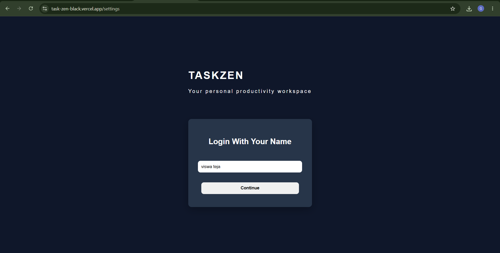

# TaskZen

TaskZen is a modern productivity and task management application built with React. It helps users organize tasks, track progress, manage notes, and visualize productivity through an analytics dashboard.

## Live Demo

https://task-zen-black.vercel.app/

## Project Highlights

* Multi-page React application using React Router
* Persistent task and notes storage using LocalStorage
* Goal tracking and productivity analytics dashboard
* Interactive charts built with Recharts
* Responsive design for mobile, tablet, and desktop
* Deployed using Vercel

## Screenshots

### Login Page



### Dashboard


### Tasks Page


### Task Notes


### Goal Tracking


### Analytics Dashboard


### Settings Page


## Features

### Task Management

* Create new tasks
* Mark tasks as completed
* Delete tasks
* Track pending and completed tasks

### Task Notes

* Open individual task pages
* Add and edit notes for each task
* Notes automatically persist using LocalStorage

### Goal Tracking

* Set task completion goals
* Monitor goal progress in real-time
* Calculate completion percentage

### Analytics Dashboard

* Productivity Score
* Task Completion Statistics
* Interactive Pie Chart Visualization
* Pending vs Completed Task Breakdown

### User Personalization

* Personalized welcome screen
* Change username anytime
* User data persistence using LocalStorage

### Responsive Design

* Mobile-friendly interface
* Tablet support
* Desktop optimized layout

## Tech Stack

### Frontend

* React
* React Router DOM
* Recharts
* React Icons

### Styling

* CSS3
* Flexbox
* CSS Grid
* Responsive Design

### Data Storage

* Browser LocalStorage

### Deployment

* GitHub
* Vercel

## Key Learning Outcomes

This project helped strengthen skills in:

* React Components
* React Hooks (useState, useEffect)
* React Router
* State Management
* LocalStorage Persistence
* CRUD Operations
* Responsive Web Design
* Component Reusability
* Data Visualization with Recharts
* Git & GitHub Workflow
* Deployment using Vercel

## Installation

Clone the repository:

```bash
git clone https://github.com/ViswaTeja0309/TaskZen.git
```

Navigate to the project folder:

```bash
cd TaskZen
```

Install dependencies:

```bash
npm install
```

Start the development server:

```bash
npm run dev
```

## Author

Viswa Teja

Frontend Developer

GitHub:
https://github.com/ViswaTeja0309

Project Repository:
https://github.com/ViswaTeja0309/TaskZen
