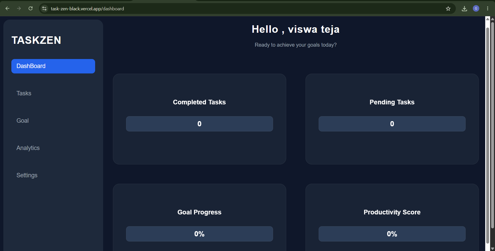
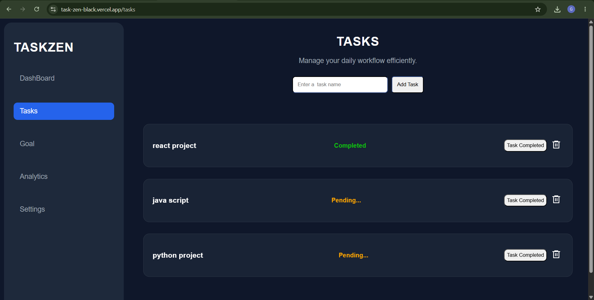
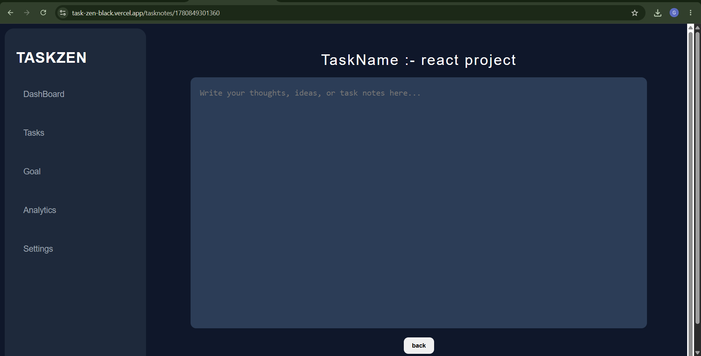
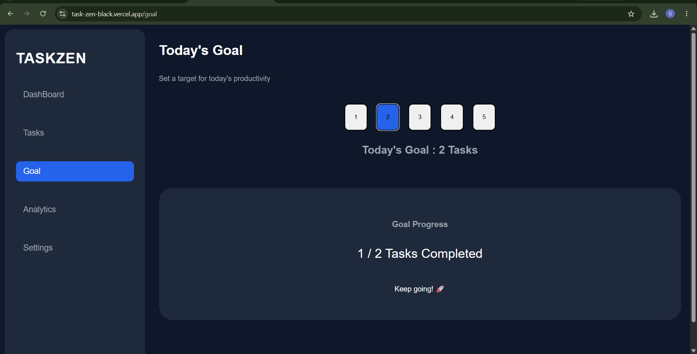
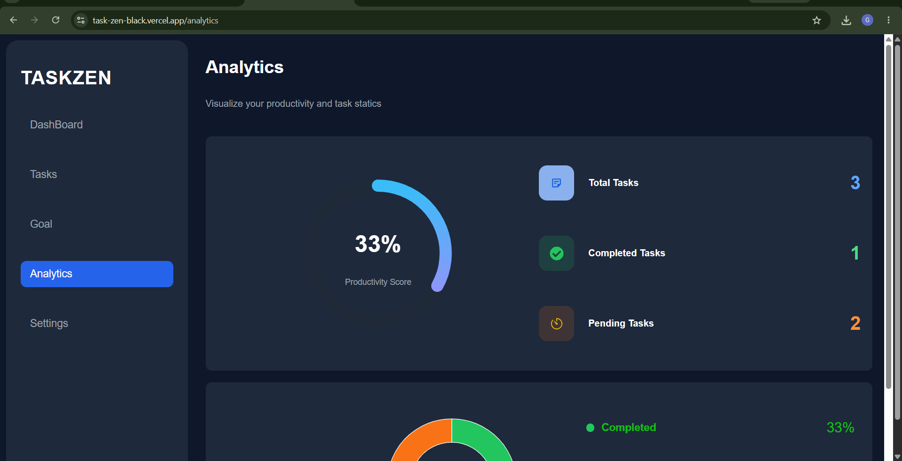
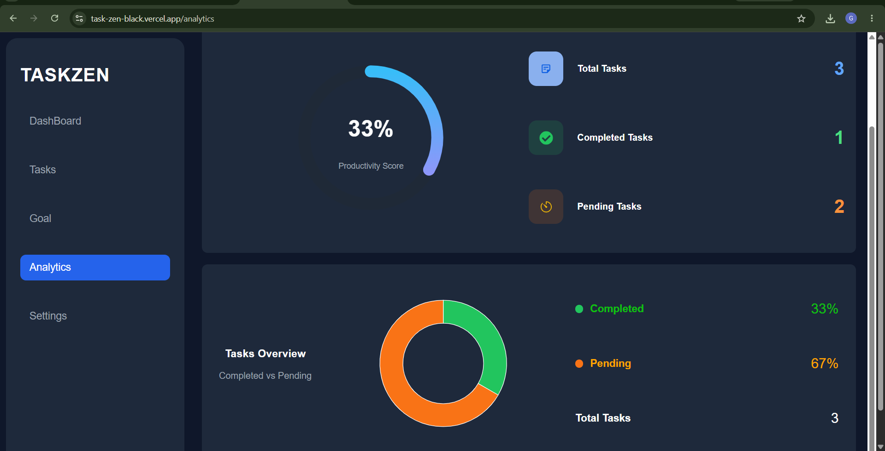
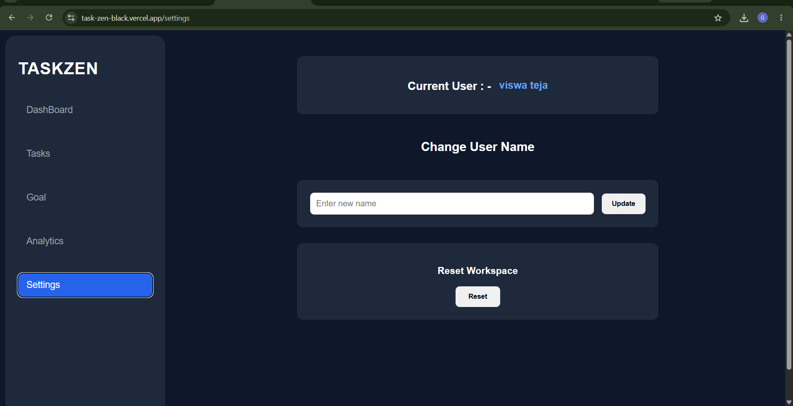

#  TaskZen

TaskZen is a modern productivity and task management application built with React. It helps users organize tasks, track progress, manage notes, and visualize productivity through an analytics dashboard.

# Live Demo Link

https://task-zen-black.vercel.app/

##  Screenshots

### Login Page

### Dashboard

### Tasks Page

### Task Notes

### Goal Tracking

### Analytics Dashboard

 | 

### Settings Page

##  Features

###  Task Management

* Create new tasks
* Mark tasks as completed
* Delete tasks
* Track pending and completed tasks

###  Task Notes

* Open individual task pages
* Add and edit notes for each task
* Notes automatically persist using LocalStorage

###  Goal Tracking

* Set task completion goals
* Monitor goal progress in real-time
* Progress percentage calculation

###  Analytics Dashboard

* Productivity Score
* Task Completion Statistics
* Interactive Pie Chart Visualization
* Pending vs Completed Task Breakdown

###  User Personalization

* Personalized welcome screen
* Change username anytime
* User data persistence with LocalStorage

###  Responsive Design

* Mobile-friendly interface
* Tablet support
* Desktop optimized layout

---

##  Tech Stack

### Frontend

* React
* React Router DOM
* Recharts
* React Icons

### Styling

* CSS3
* Flexbox
* CSS Grid
* Responsive Design

### Data Storage

* Browser LocalStorage

### Deployment

* GitHub
* Vercel

##  Key Learning Outcomes

This project helped strengthen skills in:

* React Components
* React Hooks (useState, useEffect)
* React Router
* State Management
* LocalStorage Persistence
* CRUD Operations
* Responsive Web Design
* Component Reusability
* Data Visualization with Recharts
* Git & GitHub Workflow
* Deployment using Vercel

---

## Installation

Clone the repository:

git clone https://github.com/ViswaTeja0309/taskzen.git

Navigate to the project folder:

cd taskzen

Install dependencies:

npm install

Start development server:

npm run dev

---

##  Author

**Viswa Teja**

Frontend Developer

GitHub: https://github.com/ViswaTeja0309

